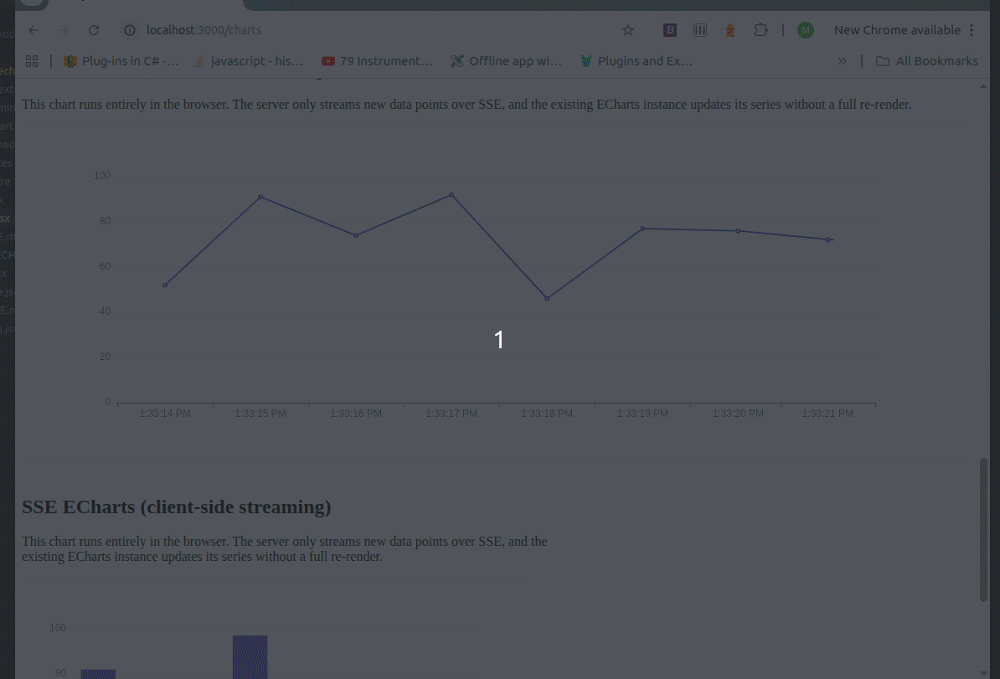

# HTMX Echarts

An `htmx` extension (`echarts`) that connects `htmx`, `ECharts`, and Server-Sent Events (SSE) for live-updating (or statically-fetched) charts.



This repository contains htmx-echarts extension and demo in bun. You can run demo following this steps: 

To install dependencies:

```bash
bun install
```

To run:

```bash
bun run index.ts
```

Besides browser-driven ECharts, the demo also contains an example of avoiding the extension by using ECharts on the server side and sending only the resulting SVG.

Pros:
+ Simpler than using ECharts on the client side
+ You can send the chart via email or easily put it into a PDF

Cons:
- Limited interactivity
- Live updates redraw the whole chart, which looks clunky

I wrote the extension to provide a better interactive experience for charts that update periodically. With the extension:

Pros:
+ Still simple (the extension does the JS work for you)
+ Rich interactivity
+ Live updates behave as users expect

Cons:
- You can't send the chart via email or put it into a PDF as easily

Depending on your use case, choose the approach that fits best. You can also combine them: stream a live chart to the client with the extension, and render a server-side SVG when you need to email or export a chart.

---

## Installation

You need:

- **HTMX**
- **ECharts** (browser bundle)
- **`htmx-echarts.js`** (this extension)

Example layout head (local bundle):

```html
<head>
  <meta charSet="UTF-8" />
  <meta name="viewport" content="width=device-width, initial-scale=1.0" />
  <title>Analytica</title>
  /* HTMX */
  <script src="/static/htmx.min.js" defer></script>
  /* ECharts must be loaded before the helper */
  <script
    src="https://cdn.jsdelivr.net/npm/echarts@5.5.0/dist/echarts.min.js"
    defer
  ></script>
  /* Extension file */
  <script src="/static/htmx-echarts.js" defer></script>
  /* or cnd */
  <script src="https://cdn.jsdelivr.net/npm/htmx-echarts@0.1.0/dist/htmx-echarts.min.js" defer></script>
</head>
```

`htmx-echarts.js` assumes `window.echarts` is available.


### 2. Enable the extension

Activate the extension on any region that contains charts (commonly `body`):

```html
<body hx-ext="echarts">
  ...
</body>
```

---

## Usage

### Frontend: Markup

Add containers with `data-chart-type` and attributes for either **SSE streaming**, **static fetch**, or **static fetch with polling**.

The behavior is:

- If `data-url` is set **and** `data-sse-event` is set → **SSE streaming** mode.
- If `data-url` is set and `data-sse-event` is **not** set → **static fetch** mode (one-shot fetch of JSON data).
- If `data-url` is set, `data-sse-event` is **not** set, and `data-url` contains a `poll:` token → **static fetch + polling** mode (initial fetch + periodic re-fetch).

#### Minimal example (line chart, SSE streaming)

```html
<section style="max-width: 640px;">
  <h2>SSE ECharts (line)</h2>

  <div
    id="sse-chart"
    data-chart-type="line"
    data-url="/sse"
    data-sse-event="chart-update"
    style="height: 400px; border: 1px solid #eee;"
  ></div>
</section>
```

#### Bar chart example (SSE streaming)

```html
<section style="max-width: 640px;">
  <h2>SSE ECharts (multi-series)</h2>

  <div
    id="sse-chart-multi"
    data-chart-type="bar"
    data-url="/sse-multi"
    data-sse-event="chart-update"
    style="height: 400px; border: 1px solid #eee;"
  ></div>
</section>
```

#### Static chart example (one-shot fetch, no SSE)

```html
<section style="max-width: 640px;">
  <h2>Static ECharts (fetch JSON once)</h2>

  <div
    id="static-chart"
    data-chart-type="line"
    data-url="/initial-data"
    style="height: 400px; border: 1px solid #eee;"
  ></div>
</section>
```

In this mode:

- The helper creates the ECharts instance and `ResizeObserver`.
- It performs a single `fetch("/initial-data")` on init.
- The JSON response must be a **full ECharts option**, for example:

  ```json
  {
    "tooltip": { "trigger": "axis" },
    "xAxis": { "type": "category", "data": ["Mon", "Tue", "Wed"] },
    "yAxis": { "type": "value" },
    "series": [
      { "name": "2011", "type": "line", "data": [10, 20, 30] },
      { "name": "2012", "type": "bar",  "data": [5, 15, 25] }
    ]
  }
  ```

  and the helper will **not** open an SSE connection (no streaming).

#### Static chart with polling (periodic fetch, no SSE)

To keep a chart updated without SSE, you can encode a polling interval into `data-url`:

```html
<section style="max-width: 740px;">
  <h2>Line chart polling every 1000ms</h2>

  <div
    id="polling-chart"
    data-chart-type="line"
    data-url="/charts/line-polling poll:1000ms"
    style="width: 100%; height: 400px; border: 1px solid #eee;"
  ></div>
</section>
```

In this mode:

- The helper creates the ECharts instance and `ResizeObserver`.
- It performs a single `fetch("/charts/line-polling")` on init.
- It then re-fetches the same URL every `1000ms` and applies the latest option.
- No SSE connection is opened.

**Supported attributes:**

- `data-chart-type` (optional): chart type hint (e.g. `"line"`, `"bar"`, `"scatter"`, `"pie"`). Helpful for semantics but not required, since the option comes from the backend.
- `data-url` (required): URL used either for SSE streaming or static JSON fetch, optionally followed by polling modifiers (see **Polling** below).
- `data-sse-event` (optional): when set, the helper opens an `EventSource` to `data-url` and listens for this SSE event name; when omitted, the helper performs a `fetch(url)` and treats the response as static data (optionally with polling).

### Polling

Polling is configured by adding whitespace-separated tokens to `data-url`. The first token is always treated as the actual URL; subsequent tokens may configure behavior:

- `poll:<duration>` — enables periodic re-fetch of the chart data.

Valid duration formats:

- Plain milliseconds: `1000` or `1000ms`
- Seconds: `1s`, `0.5s`, `2.5s`

Examples:

- `data-url="/charts/line-polling poll:1000ms"`
- `data-url="/charts/line-polling poll:1s"`

**Payload format (both static and SSE)**:

- A JSON object that is a valid ECharts option, e.g.:

  ```json
  {
    "tooltip": { "trigger": "axis" },
    "xAxis": { "type": "category", "data": ["Mon", "Tue"] },
    "yAxis": { "type": "value" },
    "series": [
      { "name": "Series A", "type": "line", "data": [1, 2] }
    ]
  }
  ```

### Backend: SSE endpoint examples

#### Hono + Bun example (single-series)

```ts
import { Hono } from "hono";
import { streamSSE } from "hono/streaming";

const app = new Hono();

// SSE endpoint for streaming a single-series ECharts option
app.get("/sse", (c) => {
  return streamSSE(c, async (stream) => {
    let id = 0;
    let aborted = false;
    const labels: string[] = [];
    const values: number[] = [];
    const maxPoints = 50;

    stream.onAbort(() => {
      aborted = true;
      console.log("SSE client disconnected");
    });

    while (!aborted) {
      const label = new Date().toLocaleTimeString();
      const value = Math.round(Math.random() * 100);

      labels.push(label);
      values.push(value);
      if (labels.length > maxPoints) {
        labels.shift();
        values.shift();
      }

      const option = {
        tooltip: { trigger: "axis" },
        xAxis: { type: "category", data: labels },
        yAxis: { type: "value" },
        series: [
          {
            name: "Random",
            type: "line",
            data: values,
          },
        ],
      };

      await stream.writeSSE({
        id: String(id++),
        event: "chart-update", // matches data-sse-event
        data: JSON.stringify(option),
      });

      await stream.sleep(1000);
    }
  });
});
```

#### Generic Node-style example (Express-like pseudo-code)

```js
app.get("/sse", (req, res) => {
  res.setHeader("Content-Type", "text/event-stream");
  res.setHeader("Cache-Control", "no-cache");
  res.setHeader("Connection", "keep-alive");

  let id = 0;
  const labels = [];
  const values = [];
  const maxPoints = 50;

  const interval = setInterval(() => {
    const label = new Date().toISOString();
    const value = Math.round(Math.random() * 100);

    labels.push(label);
    values.push(value);
    if (labels.length > maxPoints) {
      labels.shift();
      values.shift();
    }

    const option = {
      tooltip: { trigger: "axis" },
      xAxis: { type: "category", data: labels },
      yAxis: { type: "value" },
      series: [
        { name: "Random", type: "line", data: values },
      ],
    };

    res.write(
      `id: ${id++}\n` +
        `event: chart-update\n` +
        `data: ${JSON.stringify(option)}\n\n`,
    );
  }, 1000);

  req.on("close", () => {
    clearInterval(interval);
  });
});
```

#### ASP.NET Core (C#) example

Minimal API using native SSE support (`TypedResults.ServerSentEvents`):

```csharp
using System.Net;
using System.Runtime.CompilerServices;

var builder = WebApplication.CreateBuilder(args);
var app = builder.Build();

app.MapGet("/sse", (CancellationToken cancellationToken) =>
{
    async IAsyncEnumerable<SseItem<object>> GetChartUpdates(
        [EnumeratorCancellation] CancellationToken ct)
    {
        var id = 0;

        while (!ct.IsCancellationRequested)
        {
            // Build your option here (e.g. latest N points)
            var option = new
            {
                tooltip = new { trigger = "axis" },
                xAxis = new { type = "category", data = new[] { "A", "B", "C" } },
                yAxis = new { type = "value" },
                series = new[]
                {
                    new { name = "Random", type = "line", data = new[] { 1, 2, 3 } }
                }
            };

            yield return new SseItem<object>(option, eventType: "chart-update")
            {
                EventId = (id++).ToString()
            };

            await Task.Delay(1000, ct);
        }
    }

    return TypedResults.ServerSentEvents(GetChartUpdates(cancellationToken));
});

app.Run();
```

This endpoint:

- Sets the correct SSE headers.
- Streams an event named `"chart-update"` every second, matching `data-sse-event="chart-update"` on the frontend.
- Sends payloads that are **full ECharts options**, which the helper applies with `setOption`.

#### Python (Flask) example

Simple SSE endpoint using Flask:

```python
from flask import Flask, Response
import json
import time
import random

app = Flask(__name__)


def event_stream():
    event_id = 0
    labels = []
    values = []
    max_points = 50

    while True:
        labels.append(time.strftime("%H:%M:%S"))
        values.append(random.randint(0, 100))

        if len(labels) > max_points:
            labels.pop(0)
            values.pop(0)

        option = {
            "tooltip": {"trigger": "axis"},
            "xAxis": {"type": "category", "data": labels},
            "yAxis": {"type": "value"},
            "series": [
                {"name": "Random", "type": "line", "data": values},
            ],
        }
        data = json.dumps(option)

        yield (
            f"id: {event_id}\n"
            f"event: chart-update\n"
            f"data: {data}\n\n"
        )
        event_id += 1
        time.sleep(1)


@app.route("/sse")
def charts_sse():
    return Response(event_stream(), mimetype="text/event-stream")


if __name__ == "__main__":
    app.run(debug=True, threaded=True)
```

This endpoint:

- Uses a generator (`event_stream`) to yield SSE frames.
- Sets `mimetype="text/event-stream"` so browsers treat it as an SSE stream.
- Sends `chart-update` events with payloads that are **full ECharts options**.

---

## How it works

- The extension registers as `echarts` via `htmx.defineExtension("echarts", ...)`.
- On **`htmx:load`** within an `hx-ext="echarts"` region, it scans the loaded fragment for `[data-chart-type]` and initializes charts.
- On **`htmx:historyRestore`** it first cleans up charts in the restored fragment and then re-initializes them.
- On **HTMX cleanup** (`htmx:beforeCleanupElement`), for any subtree being removed inside an `hx-ext="echarts"` region, it cleans up charts.
- For each chart element:
  - Creates an ECharts instance on that element.
  - Attaches a `ResizeObserver` so the chart resizes with its container.
  - Reads:
    - `data-url`: endpoint for either SSE or static JSON fetch (optionally with polling modifiers).
    - `data-sse-event`: when present, enables SSE streaming mode.
  - **Static mode** (no `data-sse-event`):
    - Parses `data-url` into:
      - `url`: the request URL.
      - Optional `poll`: polling interval in milliseconds (see **Polling** below).
    - Performs `fetch(url)` once on initialization.
    - Expects the response body to be a **full ECharts option object**.
    - Calls `chart.setOption(option)` with that object.
    - If `poll` is set, sets up a `setInterval` to re-fetch the same URL every `poll` milliseconds and update the chart with the latest option.
  - **SSE mode** (`data-sse-event` present):
    - Creates an `EventSource(url)`.
    - Listens for SSE events with the given name.
    - For each event:
      - Parses `event.data` as JSON.
      - Expects a **full (or partial) ECharts option object**.
      - Calls `chart.setOption(option)` to update the chart.
- On cleanup it:
  - Closes any `EventSource`s.
  - Clears any polling intervals.
  - Disposes ECharts instances.
  - Disconnects `ResizeObserver`s.
  - Clears internal references on the chart elements.

So charts are:

- Automatically initialized when they appear (initial render or HTMX swap).
- Continuously updated from SSE.
- Properly cleaned up when removed, avoiding memory and connection leaks.


